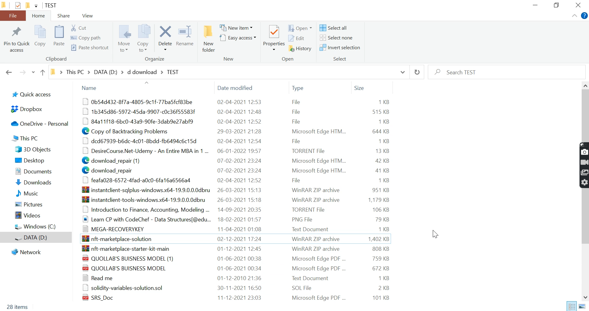

# 📁File Organizer

This is file organizer made through node js.
There are some commands that you need to use for this project.

Just simply type node main.js command(tree, organise, help)

## 1. tree
This command will display your folder and file as tree structure.

## 2. organize
This command will organize your files into suitable folder as per their file type belongs to.

## 3. help
This command will show all the list of commands that has been implemented.
<a href = "https://screenrec.com/share/aA1sShemWq">Demo</a>

### Project Explaination - 
1. 
Visit the news website as per the category input given by the user(Eg: Politics, Entertainment,etc.)

   
Input : node app.js Politics

   
(If you don't mention the category it will combination news....)
 
  
     ### Project Explaination - 

    
