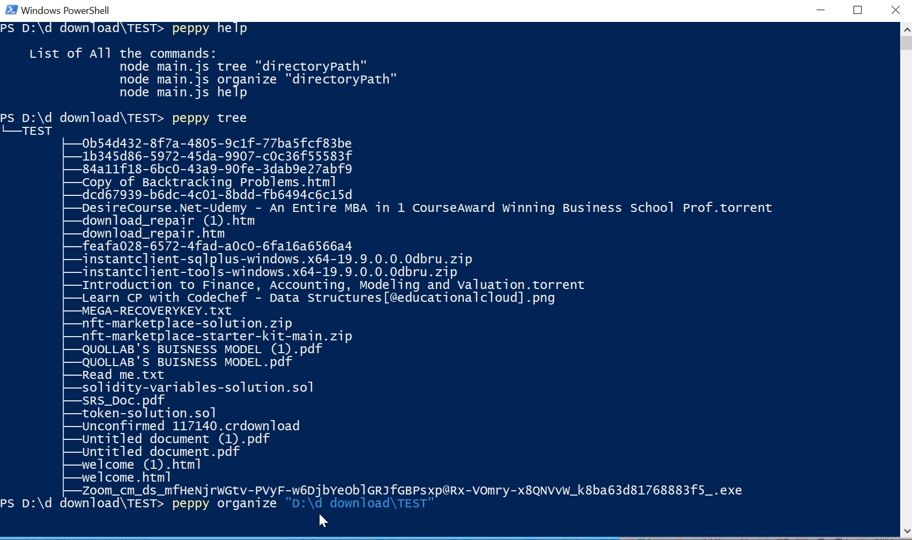
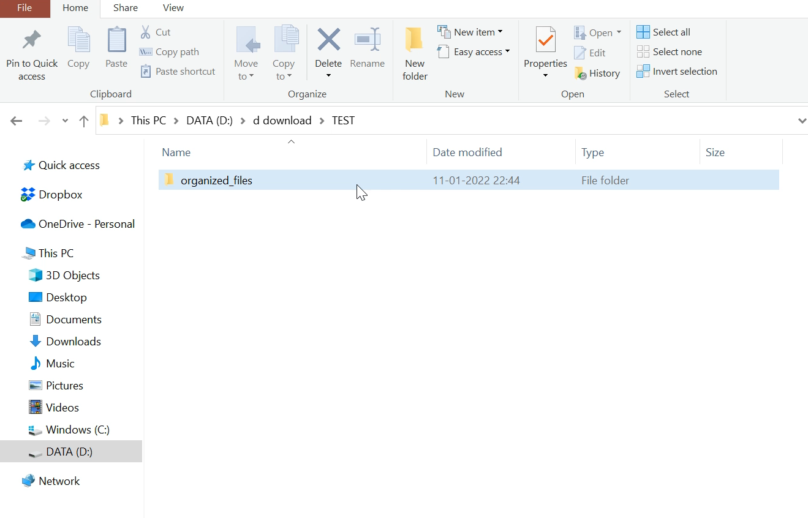
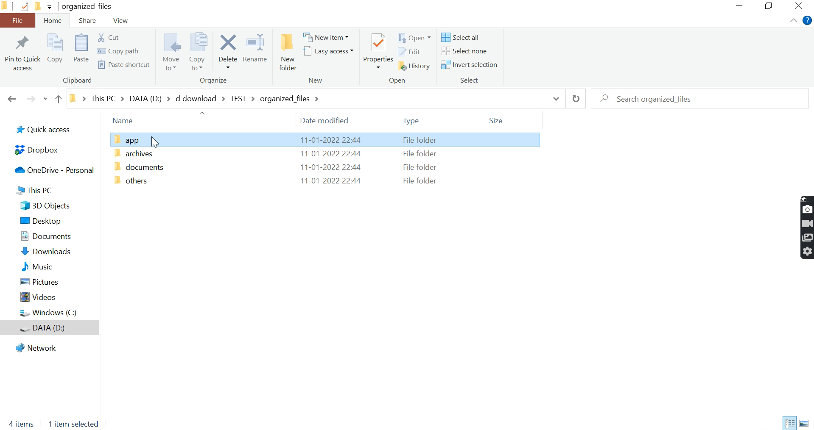
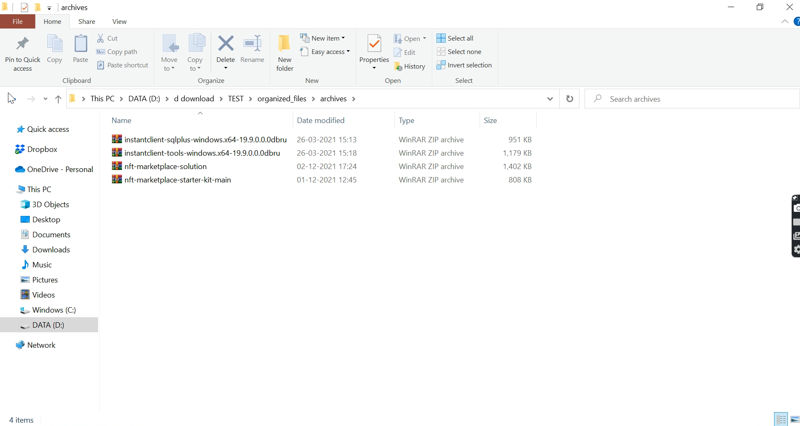
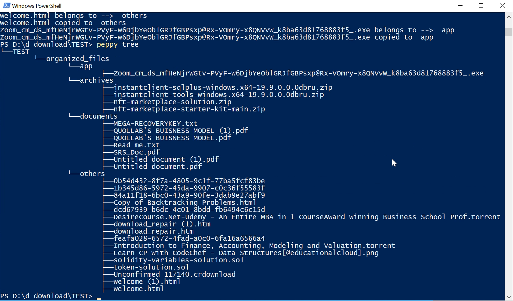

# 📁File Organizer

This is file organizer made through node js.
You can access these commands from any where of your devices

There are some commands that you need to use for this project.

Just simply type peppy command(tree, organise, help)

## 1. tree
This command will display your folder and file as tree structure.

## 2. organize
This command will organize your files into suitable folder as per their file type belongs to.

## 3. help
This command will show all the list of commands that has been implemented.


  ## Libraries Required/Installed - 
  1) path   - no need to install
  2) fs     - no need to install
  3) chalk  - to install it type/copy in cmd or teminal
  ```npm install chalk```    <a href="https://www.npmjs.com/package/chalk">Refer</a>
  4) module - then in this directory run
  ```npm install -g link```             <a href="https://www.npmjs.com/package/link">Refer</a>
## Video 
                
<a href = "https://screenrec.com/share/aA1sShemWq">Click here to see demo</a>

## Installation 
In terminal write 
git clone https://github.com/ashpreetsinghanand/File-Organizer.git
## Commands
1. peppy tree
2. peppy organize "folder path"
3. peppy help
## Project Explaination - 
1. Open your messy folder which you want to organize in case you did not have one you can open your downloads folder

  
  
   <br><br>
2. i)Open your window powershell/terminal at this folder and write command -> peppy help<br>To view all commands
 <br>ii)After typing command if you want to see tree structure of folder just type command -> peppy tree
 <br> Tree strucutre of folder will get displayed in powershell/terminal.
    <br>iii)Write command ->peppy organize "folder path"<br>To see the magic😍
 
3.  You can see insead of your files there is a folder with name "organized_files" has been present
    
4. Insdie folder "organized_files" there are sub-folders present with name "apps" , "archieves" , "documents" and "others"
    
5. Now inside all sub-folders you can see their designated files 
   
   
   <br>Here is pic of archieves folder
6. At last type peppy tree command again to beautiful organized tree structure of folder
   

    
